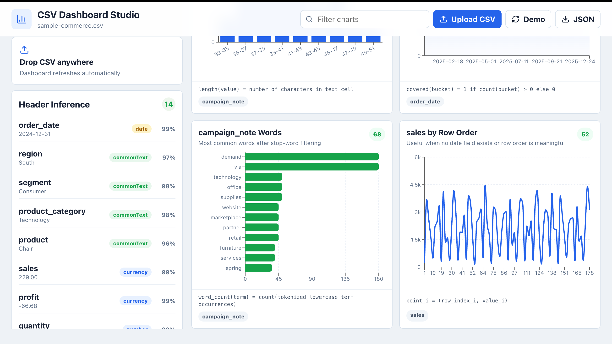
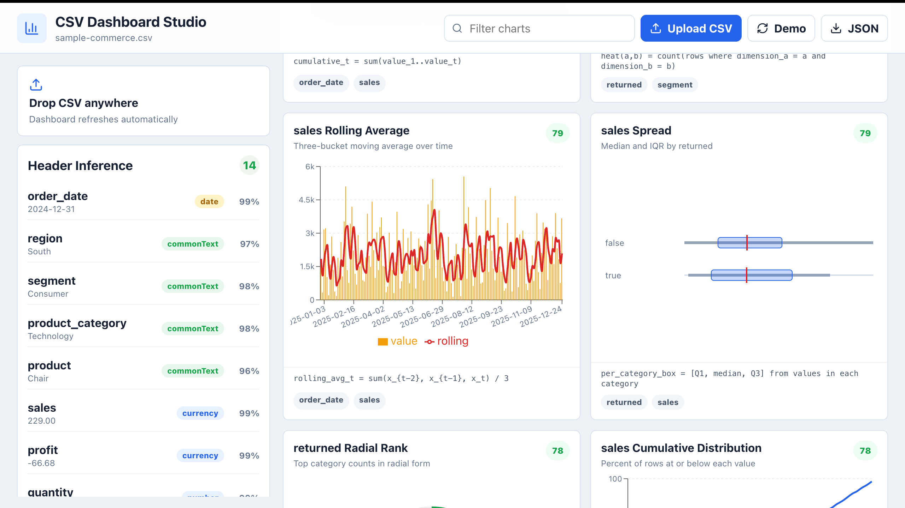
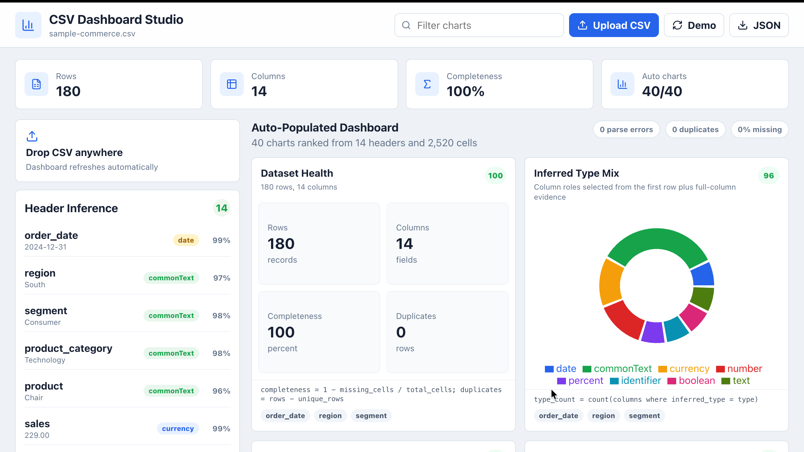

# 🚀 CSV Dashboard Studio

> Transform any CSV file into a beautiful interactive analytics dashboard in seconds.


---

## 🌟 Overview

CSV Dashboard Studio is a modern full-stack analytics platform that automatically converts raw CSV datasets into intelligent and visually rich dashboards.

Upload a CSV file and instantly generate:

- 📊 Interactive charts
- 📈 Analytics dashboards
- 🧠 Smart header inference
- 📉 Trend analysis
- 📦 Dataset health reports
- 🔍 Data distribution visualizations
- 📋 Auto-generated insights

Built for:

- Developers
- Data analysts
- Students
- Startups
- Hackathons
- Business intelligence workflows

---
# 🖼️ Project Preview

---

## 🏠 Main Dashboard



---

## 📈 Analytics & Rolling Average



---

## 📊 Smart Visualizations



---

# ✨ Features

## 📂 CSV Upload Engine

- Drag & drop CSV upload
- Instant parsing
- Auto-refresh dashboard generation

## 🧠 Smart Header Inference

Automatically detects:

- Dates
- Currency
- Numbers
- Percentages
- Identifiers
- Text fields
- Booleans

## 📊 Auto Dashboard Generation

Generates multiple chart types automatically:

- Line charts
- Bar charts
- Pie charts
- Distribution charts
- Rolling averages
- Heatmaps
- Cumulative analytics
- Box plots

## 📈 Dataset Analytics

- Completeness analysis
- Duplicate detection
- Parse error detection
- Column insights
- Type distribution

## ⚡ Fast & Modern UI

- Responsive design
- Real-time updates
- Smooth interactions
- Professional dashboard experience

---

# 🛠️ Tech Stack

## Frontend

- React
- TypeScript
- Vite
- Tailwind CSS
- Recharts

## Backend

- Node.js
- Express.js

## Other Tools

- CSV Parsing Libraries
- Data Analytics Utilities
- JSON Export Engine

---

# ⚙️ Installation & Setup

## 1️⃣ Clone Repository

```bash
git clone https://github.com/Akash-Wakade-7008-alt/Codex-CSV_TO_DASHBOARD.git
```

---

## 2️⃣ Navigate Into Project

```bash
cd Codex-CSV_TO_DASHBOARD
```

---

## 3️⃣ Install Dependencies

```bash
npm install
```

---

## 4️⃣ Run Development Server

```bash
npm run dev
```

---

## 5️⃣ Open In Browser

```bash
http://localhost:5173
```

---

# 🚀 Deployment

## Frontend Deployment

Recommended:

- Vercel
- Netlify

## Backend Deployment

Recommended:

- Render
- Railway

---

# 📂 Project Structure

```bash
CSV_DASHBOARD_STUDIO/
│
├── src/
├── public/
├── dist/
├── components/
├── charts/
├── utils/
├── package.json
├── vite.config.ts
└── README.md
```

---

# 📊 Example CSV

```csv
Name,Department,Salary
Akash,Engineering,75000
Rahul,Marketing,55000
Priya,Finance,65000
```

---

# 🔥 Why This Project Stands Out

✅ Auto-generated analytics dashboards  
✅ Smart data type inference  
✅ Beautiful chart ecosystem  
✅ Modern UI/UX  
✅ Real-world data visualization workflow  
✅ Strong portfolio-grade project  
✅ Hackathon ready  
✅ Resume worthy

---

# 🌍 Future Improvements

- 🤖 AI-generated insights
- 📤 Export dashboards as PDF
- ☁️ Cloud CSV storage
- 🔐 User authentication
- 📊 Dashboard templates
- 🧠 AI anomaly detection
- 📈 Real-time streaming analytics

---

# 🤝 Contributing

Contributions are welcome!

```bash
Fork → Clone → Create Branch → Commit → Push → Pull Request
```

---

# ⭐ Support

If you liked this project:

🌟 Star the repository  
🍴 Fork the project  
📢 Share with others

---

<p align="center">
  Built with ❤️ by Akash Wakade
</p>
